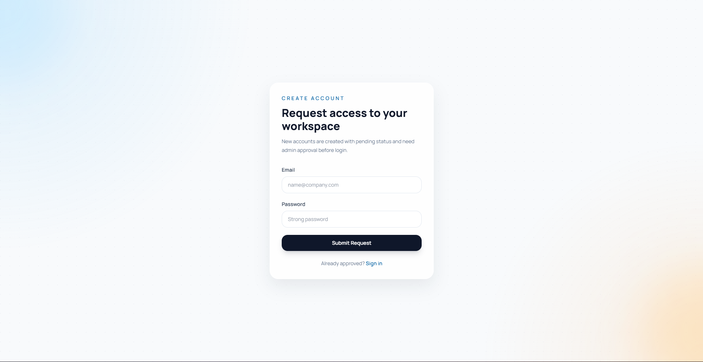
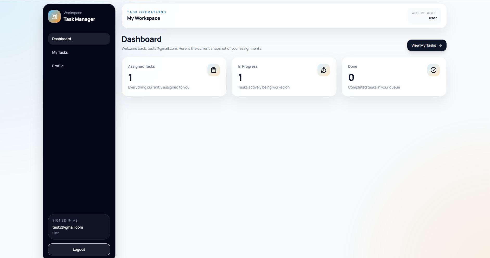

# Task Management System

A full-stack task management system built to help users manage daily tasks in a simple and organized way.

This project includes a backend server for authentication and task management, and a client-side frontend for users and admins to interact with the system.

## Features

### Authentication
- User sign in
- Secure password hashing
- JWT-based authentication
- Protected routes for authorized users only

### User Management
- Create new users
- Store user information in the database
- Role-based access support

### Task Management
- Create tasks
- View tasks
- Update tasks
- Mark tasks as done
- Track task status in an organized way

### Admin Features
- Admin page/dashboard
- Manage users
- Access protected admin routes
- Separate admin logic from normal users

### User Features
- User page/dashboard
- View personal task data
- Interact with the task system through a simple interface

## Tech Stack

### Server
- NestJS
- TypeScript
- PostgreSQL
- TypeORM
- JWT Authentication
- bcrypt

### Client
- React
- JavaScript / TypeScript
- Axios
- Basic UI styling

### Main Page


### Sign In Page


### Create User Page


### Admin Page


### User Page


## Project Structure

```bash
task-management-system/
│
├── server/     # NestJS backend
├── client/     # React frontend
└── README.md
